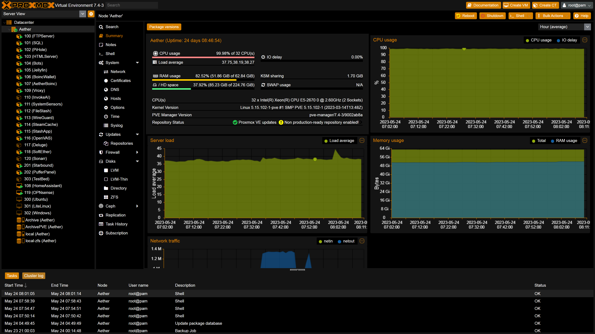
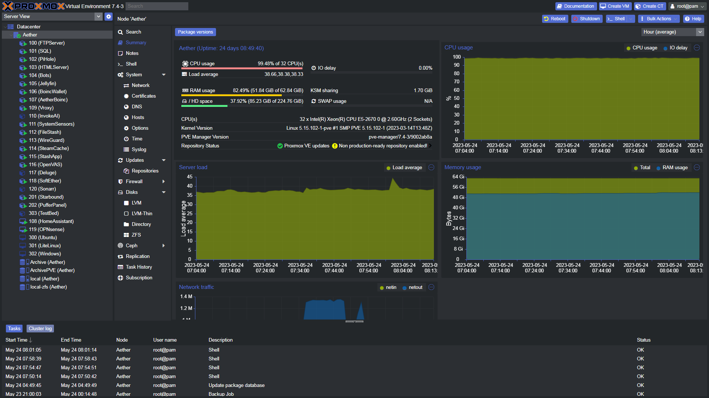
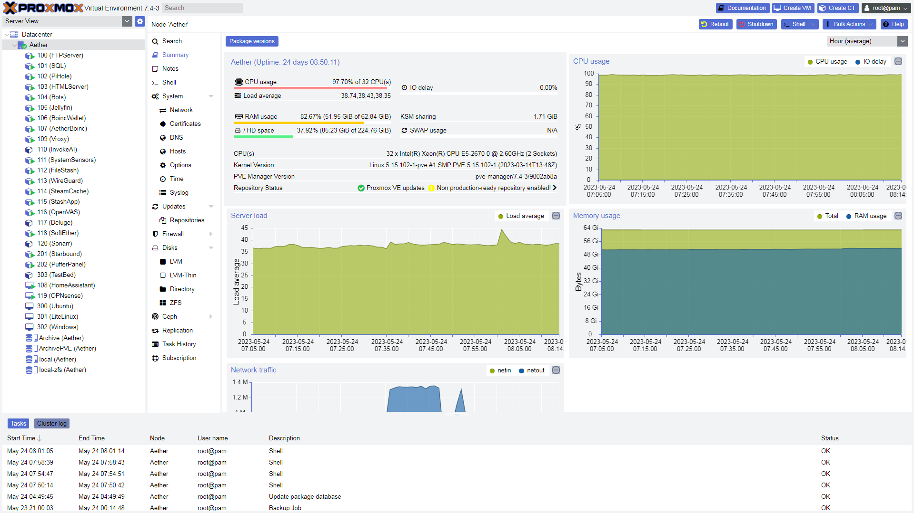

Original idea and SASS files from https://github.com/Weilbyte/PVEDiscordDark

# Supported Proxmox Versions
- 7.4
- 8.0

## UI Tweaks
there is a few additional tweaks that can be enabled using the script. These are:
- Hide the "no valid subscription" warning
- Add update buttons to the theme selector panel itself
- Add a progress bar to show how much ram ZFS Cache is using

## Installation
Run the following commands in your PVE instance:
```bash
git clone https://github.com/Happyrobot33/PVEThemes
cd PVEThemes
chmod +x install.sh
./install.sh
```

Or this one-liner:
```bash
git clone https://github.com/Happyrobot33/PVEThemes && cd PVEThemes && chmod +x install.sh && ./install.sh
```

if you have ran the install.sh script before, you can instead just directly run the python script
```bash
python3 PVEThemes.py
```





